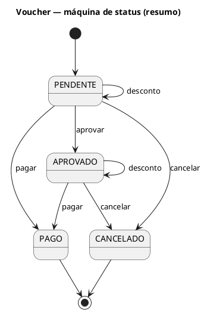

# PRD-T05: Faturas da Cooperativa

> Tela de produto do módulo Cooperativa — CoopWeb. **Extensão de tela já implementada** (relatório) + **especificação de ações novas** (aprovar/pagar/cancelar/desconto).
> Localização da rota: `app/(private)/cooperativa/[cooperativa]/faturas/` (já existe — `page.tsx`, `faturas-client.tsx`, `vouchers-cooperativa-table.tsx`).
> Pré-condição: operador autenticado (role `COOPERATIVA`), vinculado a uma cooperativa.
> Pré-requisitos técnicos: modo **produção** — sem PRD-T00/T99. Backend real `taxi-back`, endpoints já consumidos: `GET /voucher/cooperativa/{id}/mes`, `GET /voucher/cooperativa/{id}/mes/pdf`, `GET /empresa/cooperativa/{id}/label-value`, `GET /relatorio/cooperativa/{id}/motoristas/pdf`. Endpoints novos consumidos por esta rodada: `POST /voucher/{id}/aprovar`, `POST /voucher/{id}/pagar`, `POST /voucher/{id}/cancelar`, `POST /voucher/{id}/desconto`.
> Card/tarefa: — · Validação: pendente

## 1. Objetivo

O operador da cooperativa consulta os vouchers (comprovantes de pagamento) gerados por corrida, filtra por mês/ano/empresa/status, baixa relatórios em PDF (**já implementado — UC-COO-08**) e, nesta rodada, passa a poder **aprovar, registrar pagamento, cancelar e aplicar desconto** em cada voucher diretamente na tela (**UC-COO-07, novo**). Hoje a tela é só de leitura — o operador precisaria agir fora do sistema.

## 2. Layout

### 2.1 Referência

```
┌──────────────────────────────────────────────────────────────────┐
│ [← Voltar]  Faturas da Cooperativa      [Relatório Mensal]        │
│             Gestão de vouchers e pagamentos      58 vouchers      │
├──────────────────────────────────────────────────────────────────┤
│ [Mês ▾] [Ano ▾] [Empresa ▾] [Status ▾]              [Atualizar]  │
├──────────────────────────────────────────────────────────────────┤
│ Total Geral │ Pendentes │ Aprovados │ Pagos          (já existe)  │
├──────────────────────────────────────────────────────────────────┤
│ Lista de Vouchers                              [Gerar PDF]        │
│ VOUCHER  EMPRESA  ...  VALOR  STATUS      AÇÕES (novo)            │
│ VCH-001  TechCorp ...  45,00  Pendente    [Aprovar][Cancelar]     │
│ VCH-002  TechCorp ...  45,00  Aprovado    [Pagar][Desconto][Cancelar]│
│ VCH-003  AcmeCo   ...  30,00  Pago        (sem ações — terminal)  │
│ VCH-004  AcmeCo   ...  40,00  Cancelado   (sem ações — terminal)  │
└──────────────────────────────────────────────────────────────────┘

Modal "Confirmar pagamento":
┌────────────────────────────────────┐
│ Confirmar pagamento — VCH-002        │
│ Forma de pagamento * [PIX ▾]         │
│ Referência *          [_____________]│
│           [Cancelar]  [Confirmar]    │
└────────────────────────────────────┘

Modal "Aplicar desconto":
┌────────────────────────────────────┐
│ Aplicar desconto — VCH-002            │
│ Valor bruto: R$ 45,00                 │
│ Valor do desconto * [R$ ____]         │
│ Motivo *             [________________]│
│           [Cancelar]  [Aplicar]       │
└────────────────────────────────────┘
```

### 2.2 Variantes

- **Seção de consulta** (já implementada) — filtros, cards de resumo, tabela, download de PDF: sem mudança nesta rodada.
- **Ações por linha, condicionadas ao status do voucher** (novo):
  - `PENDENTE` → mostra "Aprovar", "Confirmar pagamento", "Cancelar", "Desconto".
  - `APROVADO` → mostra "Confirmar pagamento", "Cancelar", "Desconto" (sem "Aprovar" — já aprovado).
  - `PAGO` → nenhuma ação (estado terminal).
  - `CANCELADO` → nenhuma ação (estado terminal).

## 2.5 Glossário UI ↔ código

| Termo do domínio (código) | Termo na UI | O que é (1-2 frases — só se ambíguo) | Observação |
|---|---|---|---|
| `Voucher` | "Comprovante de pagamento" | — | UC-COO-07 §2 |
| `aprovarVoucher` | "Aprovar" | — | UC-COO-07 §2 |
| `marcarComoPago` | "Confirmar pagamento" | Registro manual — não há integração com meio de pagamento real; o operador confirma que pagou por fora do sistema | UC-COO-07 §2; EF Macro Financeiro §9.X |
| `status = PENDENTE` | "Aguardando aprovação" | — | já usado em `VouchersCooperativaTable` como `PENDENTE` cru — esta rodada troca pelo rótulo humanizado |
| `status = APROVADO` | "Aprovado, aguardando pagamento" | — | idem |
| `status = PAGO` | "Pago" | — | já humanizado hoje |
| `status = CANCELADO` | "Cancelado" | — | **novo no front** — hoje o tipo `VoucherCooperativa.status` nem inclui esse valor (ver Achados) |

### 2.5.1 Wording por regime/contexto

`Não aplicável — domínio opera em contexto único (EF Macro Financeiro §12.1).`

## 3. Componentes (mapping pré-validado contra o DS)

| Elemento da tela | Componente do DS | Status | Observação |
|---|---|---|---|
| Casca visual, filtros, cards de resumo, tabela, PDF | Já implementados (`faturas-client.tsx`, `vouchers-cooperativa-table.tsx`) | OK | Sem mudança |
| Coluna "Ações" na tabela | `<Button size="sm" variant="flat">` por ação, dentro de `<TableCell>` | OK | Substitui/complementa a coluna "pagamento" existente |
| Modal "Confirmar pagamento" | `<Modal>` + `<Select>` (forma de pagamento) + `<Input>` (referência) | OK | Mesmo padrão do modal "Relatório Mensal" já existente em `faturas-client.tsx` |
| Modal "Aplicar desconto" | `<Modal>` + `<Input type="number">` (valor) + `<Input>` (motivo) | OK | — |
| Modal "Cancelar" (confirmação) | `<Modal>` simples, mesmo padrão de `programadas/modal/confirm.tsx` | OK | — |
| Botão "Aprovar" (ação direta, sem modal) | `<Button size="sm" color="primary">` com confirmação inline (`useDisclosure` + modal leve) | OK | Aprovar não exige dado adicional — confirmação simples evita clique acidental |
| Chip de status (Pendente/Aprovado/Pago/Cancelado) | `<Chip>` (`@heroui/chip`) — já implementado para 3 dos 4 valores | gap parcial | Falta variante visual para `CANCELADO` (cor + ícone) |
| Toast de sucesso/erro por ação | `ShowToast` (`src/components/Toast`) | OK | — |

## 4. Interações (INT-T05-NNN)

- **INT-T05-001** Quando o operador clica em "Aprovar" em um voucher `PENDENTE`, o sistema deve pedir confirmação simples e, ao confirmar, chamar `POST /voucher/{id}/aprovar`; em sucesso, atualizar o status do voucher na tabela para "Aprovado, aguardando pagamento" sem reload da página.
- **INT-T05-002** Quando o operador clica em "Confirmar pagamento" em um voucher `PENDENTE` ou `APROVADO`, o sistema deve abrir o modal pedindo forma de pagamento e referência; ao confirmar, chamar `POST /voucher/{id}/pagar` e atualizar o status para "Pago".
- **INT-T05-003** Quando o operador clica em "Cancelar" em um voucher `PENDENTE` ou `APROVADO`, o sistema deve pedir confirmação e, ao confirmar, chamar `POST /voucher/{id}/cancelar`, atualizando o status para "Cancelado".
- **INT-T05-004** Quando o operador clica em "Desconto" em um voucher `PENDENTE` ou `APROVADO`, o sistema deve abrir o modal pedindo valor do desconto e motivo (obrigatório); ao confirmar, chamar `POST /voucher/{id}/desconto` e atualizar o valor total exibido.
- **INT-T05-005** Se qualquer ação falhar (ex.: voucher mudou de status entre o carregamento da tela e o clique — condição de corrida com outro operador), então o sistema deve exibir um toast de erro com a mensagem de negócio retornada e manter o voucher com o status anterior até o próximo "Atualizar".
- **INT-T05-006** Enquanto uma ação está em andamento, o sistema deve desabilitar os botões de ação daquela linha específica, sem bloquear as demais linhas.

## 5. Estados (default, loading, vazio, erro, variantes por status)

Ver `diagrams/prd-t05-fsm-ui.puml` — FSM incluído porque o voucher tem 4 estados com transições guardadas (pagar alcançável a partir de 2 estados; desconto é um self-loop condicionado; 2 estados terminais).



Estados de tela por linha: **default** (ações disponíveis conforme status) · **ação em andamento** (botões da linha em loading) · **sucesso** (status atualizado + toast) · **erro de negócio** (toast, status inalterado) · **erro técnico/rede** (toast genérico).

## 6. Side-effects (entre telas)

| Origem | Efeito nesta tela |
|---|---|
| **PRD-T01 (Cadastrar Empresa)** — nova empresa criada | Aparece no filtro "Empresa" desta tela no próximo carregamento |
| Ação de aprovar/pagar/cancelar/desconto nesta tela | Atualiza os cards de resumo (Total Geral, Pendentes, Aprovados, Pagos) sem exigir novo "Atualizar" — recalculados a partir da lista local já em memória |
| Finalização de viagem (fora desta rodada, RF-01) | Gera novo voucher `PENDENTE` que aparece nesta tela no próximo "Atualizar" ou ao trocar mês/ano |

## 7. Dados Mockados (TS literal — exemplo de payload/resposta real)

```ts
// Extensão necessária do tipo hoje em src/model/relatorio-vouchers.ts —
// status hoje não inclui "CANCELADO" (ver Achados)
export interface VoucherCooperativa {
  id: string;
  numeroVoucher: string;
  dataEmissao: string;
  dataVencimento: string;
  nomeEmpresa: string;
  nomeMotorista: string;
  nomePassageiro: string;
  valorTotal: number;
  status: "PAGO" | "PENDENTE" | "APROVADO" | "CANCELADO"; // CANCELADO adicionado nesta rodada
  formaPagamento: string | null;
  origemViagem: string;
  destinoViagem: string;
  observacao: string;
}

// Payload — aprovar (POST /voucher/{id}/aprovar): sem corpo

// Payload — confirmar pagamento (POST /voucher/{id}/pagar)
const pagarPayload = { formaPagamento: "PIX", referenciaPagamento: "E12345678202608151030" };

// Payload — cancelar (POST /voucher/{id}/cancelar): sem corpo

// Payload — aplicar desconto (POST /voucher/{id}/desconto)
const descontoPayload = { valorDesconto: 5.0, motivoDesconto: "Corrida com atraso reportado pelo passageiro" };

// Erro de negócio — ação inválida para o status atual (400)
const erroStatusInvalido = { status: 400, message: "Voucher não está pendente de aprovação" };

// Erro de negócio — desconto sem motivo (400, EF Macro Financeiro §7.2)
const erroDescontoSemMotivo = { status: 400, message: "Motivo do desconto é obrigatório" };
```

## 8. Regras de Negócio aplicadas no front (FR-T05-NNN)

- **FR-T05-001** Onde o voucher estiver `PENDENTE`, o sistema deve exibir a ação "Aprovar"; fora desse estado, a ação não deve aparecer. _(EF Macro Financeiro §5 RF-02, regra R1)_
- **FR-T05-002** Onde o voucher estiver `PENDENTE` ou `APROVADO`, o sistema deve exibir a ação "Confirmar pagamento"; em `PAGO` ou `CANCELADO`, não. _(EF Macro §5 RF-02, regra R2)_
- **FR-T05-003** Se o voucher já estiver `PAGO`, então o sistema não deve exibir a ação "Cancelar" — cancelamento só é permitido em `PENDENTE`/`APROVADO`. _(EF Macro §5 RF-02, regra R3)_
- **FR-T05-004** Onde o voucher não estiver `PAGO` nem `CANCELADO`, o sistema deve exibir a ação "Desconto"; ao aplicar, deve exigir um motivo (campo obrigatório) antes de enviar ao backend. _(EF Macro §5 RF-02, regra R4; EF Macro §7.2, validação de `motivoDesconto`)_
- **FR-T05-005** Quando um desconto é aplicado, o sistema deve atualizar o valor total exibido do voucher, mas não deve exibir nem calcular um "valor líquido do motorista" — esse cálculo nunca é feito pelo backend (gap confirmado, RN-04) e exibir um número aqui seria mostrar dado incorreto. _(EF Macro §6 RN-04; UC-COO-07 §6 A2)_
- **FR-T05-006** O sistema não deve integrar com nenhum meio de pagamento real ao confirmar pagamento — é um registro manual de que o pagamento ocorreu por fora do sistema. _(UC-COO-07 §10; EF Macro §9.X)_

## 9. Notas de Implementação

- Adicionar coluna "Ações" em `vouchers-cooperativa-table.tsx`, com os botões condicionados ao `status` da linha (ver §2.2).
- Cada ação é uma Server Action `"use server"` nova (`aprovar-voucher.ts`, `pagar-voucher.ts`, `cancelar-voucher.ts`, `aplicar-desconto-voucher.ts`), seguindo o padrão de `assign-motorista.ts`/`encerrar-programacao.ts` (retorno `{success, message}`).
- Após sucesso de qualquer ação, atualizar o item correspondente no estado local (`relatorio.vouchers`) em vez de refazer o fetch completo — mantém os filtros aplicados e evita "pulo" de tela.
- Estender `src/model/relatorio-vouchers.ts` (`VoucherCooperativa.status`) para incluir `"CANCELADO"`, e mapear cor/ícone no mesmo padrão de `getStatusColor`/`getStatusIcon` já existentes em `vouchers-cooperativa-table.tsx`.
- Casca visual "Liquid Glass" já existente — **sem mudança nesta rodada** (é tela já em produção; re-skinning é decisão à parte, fora do escopo de adicionar as 4 ações de voucher). Nota: PRD-T01/T02/T03/T04 desta mesma release adotaram casca limpa (`bg-gray-50` + `Card`) por decisão revisada do PO — isso deixa T05 como a única tela "glass" remanescente do módulo cooperativa. Harmonizar (migrar T05 para a casca limpa) é candidato a uma rodada futura — ver Achados.
- **Hierarquia de botões (coluna Ações, novo):** por linha, os botões seguem sempre a mesma ordem da esquerda para a direita — Aprovar, Confirmar pagamento, Desconto, Cancelar — mesmo quando algum não aparece para o status atual (evita que o operador precise reler a posição a cada linha). "Cancelar" sempre no fim, com `color="danger"`, visualmente separado dos demais por espaçamento maior — ação destrutiva não fica ao lado de ações neutras sem distinção.

## 10. Critérios de Aceite (AC-T05-NNN + NFR-T05-NNN)

### AC-T05-001 — Aprovar voucher pendente

**Cenário 1 (happy):**
> Dado que o voucher da corrida de "João Silva" de R$ 45,00 está "Aguardando aprovação"
> Quando o operador clica em "Aprovar" e confirma
> Então o voucher passa para "Aprovado, aguardando pagamento" na tabela, sem reload da página _(EF Macro §5 RF-02, regra R1)_

**Cenário 2 (borda):**
> Dado que o card "Pendentes" mostra R$ 45,00 antes da aprovação
> Quando o voucher acima é aprovado
> Então o card "Pendentes" passa a R$ 0,00 e o card "Aprovados" passa a R$ 45,00, sem exigir "Atualizar"

**Cenário 3 (erro):**
> Dado que o voucher já foi aprovado por outro operador entre o carregamento da tela e o clique
> Quando o operador tenta aprová-lo novamente
> Então o sistema exibe um toast de erro "Voucher não está pendente de aprovação" e mantém o status exibido até o próximo "Atualizar"

_(↔ US-COO-07.1, US-COO-07.5)_

### AC-T05-002 — Registrar pagamento de voucher aprovado

**Cenário 1 (happy):**
> Dado que o voucher de "João Silva" de R$ 45,00 está "Aprovado, aguardando pagamento"
> Quando o operador abre "Confirmar pagamento", informa forma de pagamento "PIX" e referência "E12345678202608151030", e confirma
> Então o voucher passa para "Pago" _(EF Macro §5 RF-02, regra R2)_

**Cenário 2 (borda):**
> Dado que o operador deixa o campo "Referência" vazio
> Quando ele tenta confirmar
> Então o sistema bloqueia o envio e sinaliza o campo obrigatório

**Cenário 3 (erro):**
> Dado que o voucher está "Cancelado"
> Quando o operador tenta registrar o pagamento desse voucher
> Então o sistema exibe um toast de erro e a ação "Confirmar pagamento" nem deveria estar visível para esse status _(EF Macro §5 RF-02, regra R2)_

_(↔ US-COO-07.2, US-COO-07.6)_

### AC-T05-003 — Cancelar voucher

**Cenário 1 (happy):**
> Dado que o voucher de "João Silva" de R$ 45,00 está "Aguardando aprovação"
> Quando o operador clica em "Cancelar" e confirma
> Então o voucher passa para "Cancelado" _(EF Macro §5 RF-02, regra R3)_

**Cenário 2 (erro):**
> Dado que o voucher de "João Silva" está "Pago"
> Quando a tabela renderiza essa linha
> Então a ação "Cancelar" não é exibida — evitando a tentativa que o backend recusaria

_(↔ US-COO-07.3, US-COO-07.7)_

### AC-T05-004 — Aplicar desconto no valor do voucher

**Cenário 1 (happy):**
> Dado que o voucher de "João Silva" está "Aprovado, aguardando pagamento", com valor bruto de R$ 45,00
> Quando o operador abre "Desconto", informa valor "R$ 5,00" e motivo "Corrida com atraso reportado pelo passageiro", e confirma
> Então o valor total do voucher passa a ser R$ 40,00 na tabela _(EF Macro §5 RF-02, regra R4)_
> E nenhum "valor líquido do motorista" é exibido nesta tela (gap conhecido, RN-04)

**Cenário 2 (borda):**
> Dado que o operador informa o valor do desconto mas deixa o campo "Motivo" vazio
> Quando ele tenta confirmar
> Então o sistema bloqueia o envio e sinaliza o campo obrigatório, sem chamar o backend

**Cenário 3 (erro):**
> Dado que o voucher está "Pago"
> Quando a tabela renderiza essa linha
> Então a ação "Desconto" não é exibida

_(↔ US-COO-07.4)_

### Âncoras visuais

- **AC-T05-005 (variabilidade)** — Cada linha da tabela mostra dados reais do voucher; ações visíveis mudam conforme o status real, nunca fixas.
- **AC-T05-006 (CTA insubstituível)** — No máximo uma ação "Aprovar", uma "Confirmar pagamento", uma "Cancelar" e uma "Desconto" por linha — nunca duplicadas.
- **AC-T05-007 (paleta canônica)** — Chip de status usa a mesma paleta já estabelecida (`success`=Pago, `warning`=Pendente, `primary`=Aprovado) mais `danger`=Cancelado (novo, seguindo a mesma convenção semântica).
- **AC-T05-008 (defaults do DS)** — Botões de ação por linha seguem `size="sm"` consistente com o restante da tabela; nenhum padding customizado sem necessidade.

### NFRs quantificados

- **NFR-T05-001 Acessibilidade** — WCAG 2.1 AA; todo botão de ação tem `aria-label` incluindo o número do voucher (ex.: "Aprovar voucher VCH-2026-001").
- **NFR-T05-002 Reatividade** — Cards de resumo (Total/Pendentes/Aprovados/Pagos) recalculam a partir do estado local em até 500ms após qualquer ação, sem exigir "Atualizar".
- **NFR-T05-003 Tratamento de condição de corrida** — Ação que falha por status desatualizado (outro operador agiu primeiro) exibe toast de erro claro, nunca uma tela em branco ou erro não tratado.

## 11. Referências

- UC-COO-07 (Aprovar e pagar vouchers de motoristas) — §5, §6 (A1/A2, E1-E3), §8, §10, §11.
- UC-COO-08 (Gerar relatório de vouchers por período) — §5, §6, §11 (já implementado).
- EF Macro Financeiro — §4.2 (Voucher), §5 RF-02/RF-03, §6 (RN-04, RN-05), §7.2 (validação de `motivoDesconto`).
- PRDs vizinhos: **PRD-T01 (Cadastrar Empresa)** — alimenta o filtro "Empresa" desta tela.
- **Dependência de feature externa**: emissão de nota fiscal e integração com gateway de pagamento são explicitamente fora de escopo (EF Macro §9.X) — "Confirmar pagamento" é só registro manual, nunca chama um gateway real.
